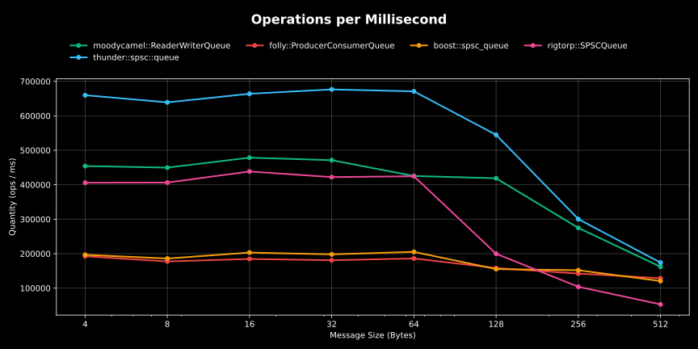
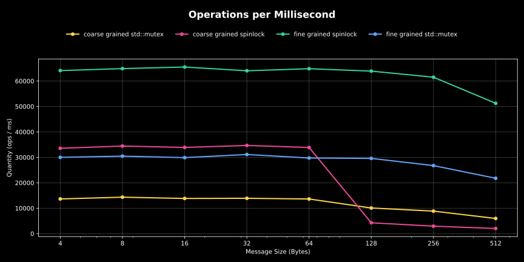
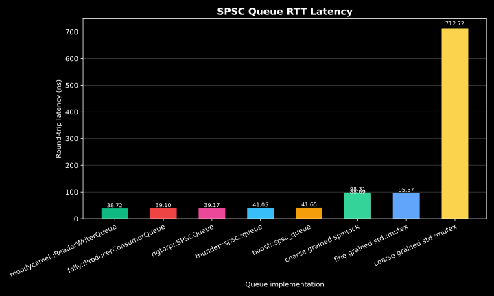
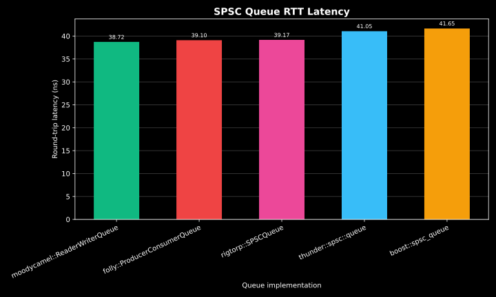
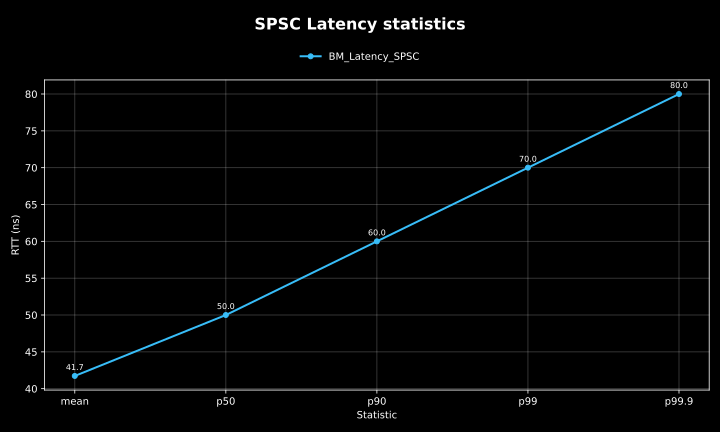

# Lock Free Queues

## Table of Contents
1. [mpmc_queue](#mpmc_queue)  
   1.1. [Overview](#overview)  
   1.2. [Benchmarks](#benchmarks)
2. [spsc_queue](#spsc_queue)   
   2.1. [Overview](#overview-1)  
   2.2. [Benchmarks](#benchmarks-1)

---

## mpmc_queue
### Overview
### Benchmarks

---

## spsc_queue
### Overview
### Benchmarks
#### 📊 `thunder::spsc::queue` Benchmark Results:
thunder::spsc::queue is a lock-free single-producer/single-consumer (SPSC) queue designed for high-throughput, low-latency message passing.

This document presents benchmarks comparing `thunder::spsc::queue` against well-established, widely used SPSC queue implementations, including those backed by major open-source projects and companies (e.g., Folly, Boost, moodycamel, rigtorp) as well as lock-based queue variants.

##### Test system:
* CPU: AMD Ryzen 9 7900X (12 cores / 24 threads) @ 4.70 GHz
* Caches:
  * L1 Data: 32 KiB × 12
  * L1 Instruction: 32 KiB × 12
  * L2 Unified: 1 MiB × 12
  * L3 Unified: 32 MiB × 2

##### Lock-Free SPSC Queue Throughput

Throughput is measured as b>operations<b> per millisecond across varying message sizes.

###### Observations:

* `thunder::spsc::queue` consistently achieves the highest throughput at all message sizes.
* At small to medium messages, `thunder::spsc::queue` can sustain ~670k ops/ms

##### Lock-Based SPSC Queue Variants
We also benchmarked coarse-grained and fine-grained locking strategies using both spinlocks and `std::mutex`.

###### Observations:
* Even the best-performing lock-based queues are 10× slower than lock-free implementations.
* Fine-grained spinlocks have the highest throughput among lock-based designs but remain far behind any lock-free queue.

##### SPSC Queue Latency
###### All queues

* Lock-based queues exhibit dramatically higher latency (e.g., coarse-grained std::mutex at ~700 ns).
* Lock-free queues stay within ~38–42 ns.

###### Lock-free queues Only

* All lock-free implementations show tight latency clustering.
* `thunder::spsc::queue` is within ~2 ns of the fastest competitor.

###### thunder::spsc latency distribution

* Mean latency: 41.7 ns
* Median (p50): 50 ns
* Tail latency (p99.9): 80 ns
* Distribution is narrow and predictable, making the queue suitable for latency-sensitive applications.

##### Interpreting The Results
Benchmarking concurrent data structures is inherently challenging:
* Results can vary greatly depending on hardware, cache hierarchy, core topology, workload patterns, and compiler optimizations.
* These numbers represent one specific test setup on the hardware listed above.

If <b>high throughput<b> or <b>low latency<b> is critical for your application, you should benchmark on your own systems with representative workloads to make an informed choice.

##### Conclusion
* thunder::spsc::queue achieves the best throughput among all tested SPSC queues.
* It offers latency on par with the fastest lock-free implementations, with a stable distribution and no spikes.
* Lock-based designs are not competitive in either throughput or latency.
