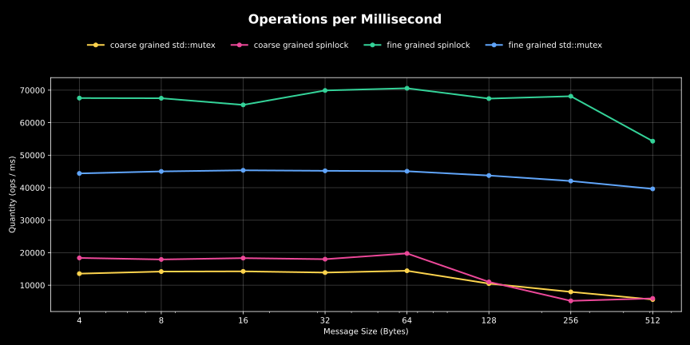

# 📊 `spsc::queue` benchmark result:

## Test system:
* CPU: AMD Ryzen 9 7900X (12 cores / 24 threads) @ 4.70 GHz
* Caches:
  * L1 Data: 32 KiB × 12
  * L1 Instruction: 32 KiB × 12
  * L2 Unified: 1 MiB × 12
  * L3 Unified: 32 MiB × 2

## Lock-Free SPSC Queue Throughput
The benchmark compares `thunder::spsc::queue` against several well-established, widely used single-producer/single-consumer queue implementations, including those backed by major open-source projects and companies (e.g., Facebook/Meta’s Folly, Boost, moodycamel).

Throughput is measured as operations per millisecond across varying message sizes.

### Key findings:
* `thunder::spsc::queue` consistently delivers top performance, outperforming all tested competitors at every message size.
* Even the slowest lock-free implementation still significantly outperforms any lock-based alternative tested.

## Lock-Based SPSC Queue Variants
We also benchmarked coarse-grained and fine-grained locking strategies using both spinlocks and `std::mutex`.

### Key findings:
* Fine-grained spinlock achieves the highest throughput among lock-based approaches, followed by fine-grained std::mutex.
* However, even the best lock-based variant is still much slower than the slowest lock-free queue.
* Coarse-grained locking (both spinlock and mutex) was the poorest performer — these are essentially `std::queue` operations wrapped in a single mutex, forcing full serialization.

## Interpreting The Results
Benchmarking concurrent data structures is inherently challenging:
* Results can vary greatly depending on hardware, cache hierarchy, core topology, workload patterns, and compiler optimizations.
* These numbers represent one specific test setup on the hardware listed above.
  
If <b>high throughput<b> is critical for your application, you should benchmark on your own systems with representative workloads to make an informed choice.

## Conclusion
* thunder::spsc::queue — the fastest of all tested SPSC queue implementations under the measured conditions.
* For maximum performance in single-producer/single-consumer scenarios, a lock-free design remains the clear winner.
* Lock-based approaches may have specific use cases, but for throughput-sensitive workloads, the performance gap is substantial.

