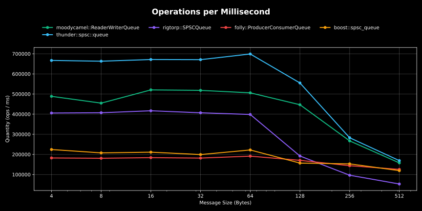

`spsc::queue` benchmark result:

CPU: AMD Ryzen 9 7900X 12-Core Processor 4.70 GHz 
CPU Caches: 
L1 Data 32 KiB (x12) 
L1 Instruction 32 KiB (x12) 
L2 Unified 1024 KiB (x12) 
L3 Unified 32768 KiB (x2)

